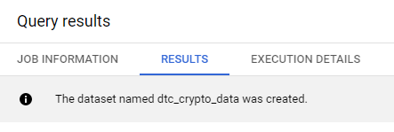
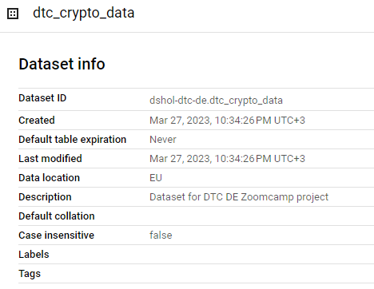
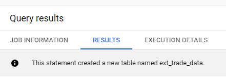
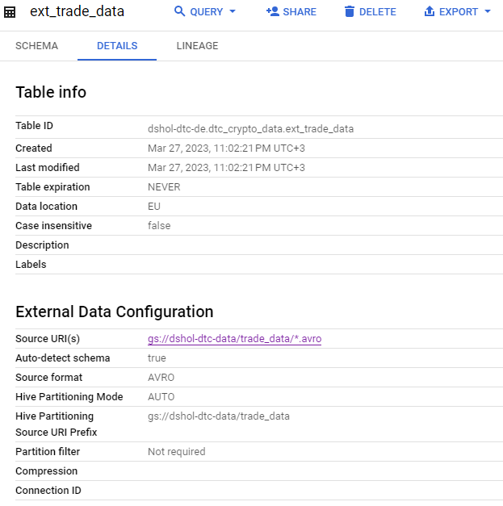

## Instructions to set up data warehouse (BigQuery)

#### 1. Navigate to GCP BigQuery.

#### 2. Open new query tab.

#### 3. Run query from [create_dataset.sql](create_dataset.sql) to create new dataset.

#### 4. Run query from [ext_trade_data](ext_trade_data.sql) to create external table from data files.

