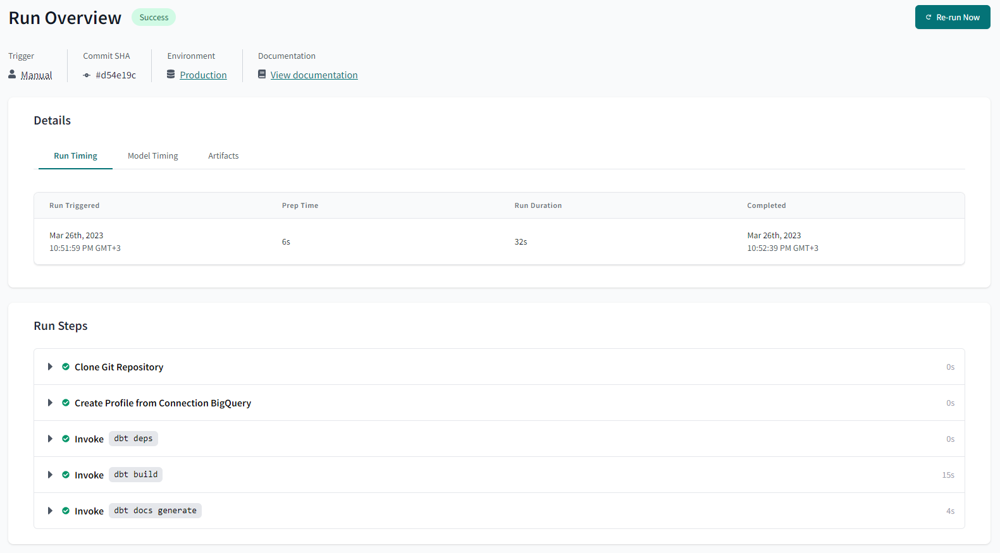
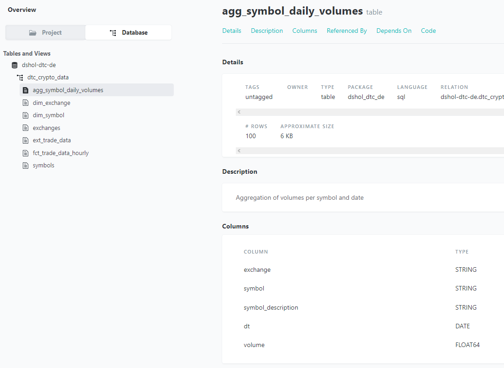

## Instructions for data modeling with dbt

### Prerequisites:

- GCP Service Account with permissions 'BigQuery Admin' and 'Storage Admin'
- dbt Cloud

### Steps:

1. Create dbt project from GitHub or just start a new project and copy-paste files from GitHub repo to dbt project (don't forget to create new branch)

Project structure is following:


2. In dbt terminal run commands:

* install dependencies:
```commandline
dbt deps
```

* create models:
```commandline
dbt run
```


* run tests:
```commandline
dbt test
```


You can check `agg_symbol_daily_volumes` lineage:


3. Create deployment - it will recreate models (as source data may grow, we need to refresh our data models)

* commit changes, merge into main branch

* navigate to "Deploy" -> "Environments", create new environment (e.g. "Production")

* navigate to "Deploy" -> "Jobs", create new job:
   - Job name: dbt build
   - Environment: Production
   - Generate docs on run: checked
   - Commands: `dbt build`
   - Triggers: run on schedule + every day + every 8 hours

* open created job and run it manually


You can see job overview, check logs and documentation:




After some time you can see job's run history:


