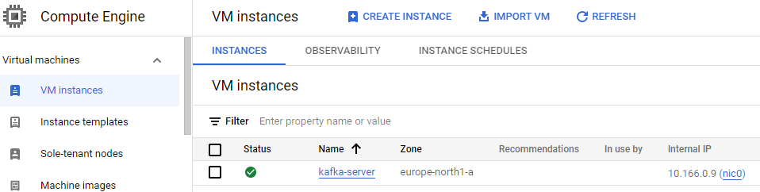
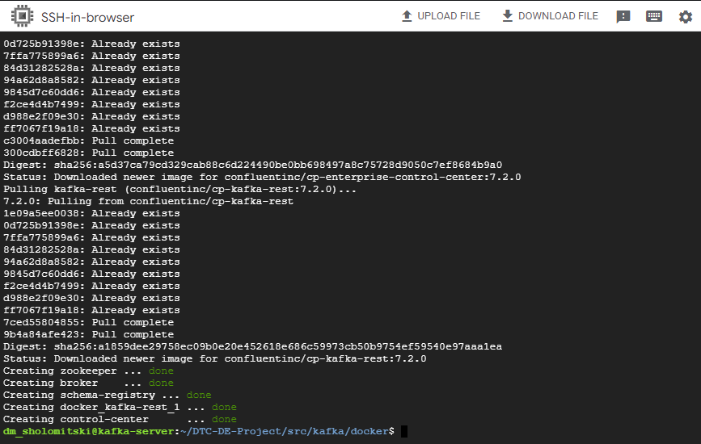
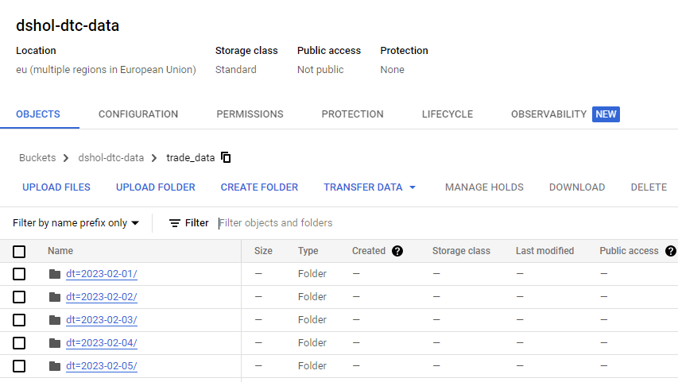
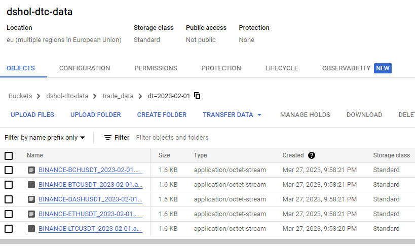

## Instructions for data collection with Kafka

#### 1. Activate **Cloud Shell** on GCP and run (fill in PROJECT and SERVICE_ACCOUNT variables):
*Note: SERVICE_ACCOUNT must have write access to Cloud storage*
```commandline
PROJECT=...
SERVICE_ACCOUNT=...
ZONE=europe-north1-a
gcloud compute instances create kafka-server \
    --project=$PROJECT \
    --zone=$ZONE \
    --machine-type=e2-medium \
    --network-interface=network-tier=PREMIUM,subnet=default \
    --maintenance-policy=MIGRATE \
    --provisioning-model=STANDARD \
    --service-account=$SERVICE_ACCOUNT \
    --scopes=https://www.googleapis.com/auth/devstorage.read_write,https://www.googleapis.com/auth/logging.write,https://www.googleapis.com/auth/monitoring.write,https://www.googleapis.com/auth/servicecontrol,https://www.googleapis.com/auth/service.management.readonly,https://www.googleapis.com/auth/trace.append \
    --create-disk=auto-delete=yes,boot=yes,device-name=kafka-server,image=projects/debian-cloud/global/images/debian-11-bullseye-v20230306,mode=rw,size=10,type=projects/$PROJECT/zones/$ZONE/diskTypes/pd-balanced \
    --tags=http-server,https-server \
    --no-shielded-secure-boot \
    --shielded-vtpm \
    --shielded-integrity-monitoring \
    --labels=ec-src=vm_add-gcloud \
    --reservation-affinity=any
```

#### 2. Navigate to Compute Engine -> VM instances and connect to terminal via **SSH** button:



#### 3. In terminal run commands:

Run Kafka server:
```commandline
sudo apt update
sudo apt install git -y
sudo apt install docker -y
sudo apt install docker-compose -y

sudo docker network create kafka-network
sudo docker volume create --name=hadoop-distributed-file-system

git clone https://github.com/dmitry-rvn/DTC-DE-Project.git
cd DTC-DE-Project/src/kafka/docker

sudo docker-compose up -d
```



Set [finnhub.io](https://finnhub.io/) API key:
```commandline
API_KEY=...
```

Run producer:
```commandline
cd ~
sudo apt-get install wget build-essential libreadline-dev libncursesw5-dev libssl-dev libsqlite3-dev tk-dev libgdbm-dev libc6-dev libbz2-dev libffi-dev zlib1g-dev -y
sudo apt-get install liblzma-dev
wget -c https://www.python.org/ftp/python/3.10.0/Python-3.10.0.tar.xz
tar -Jxvf Python-3.10.0.tar.xz
cd Python-3.10.0
./configure --enable-optimizations
sudo make altinstall
sudo apt install git -y
cd ..
git clone https://github.com/dmitry-rvn/DTC-DE-Project.git
cd DTC-DE-Project
pip3.10 install -r requirements.txt

KAFKA_HOST=0.0.0.0
python3.10 src/kafka/producer.py -h $KAFKA_HOST -k $API_KEY -s 2023-02-01T00:00:00 -e 2023-03-26T23:59:59 -c BINANCE:ETHUSDT -c BINANCE:BTCUSDT -c BINANCE:DOGEUSDT -c BINANCE:LTCUSDT -c BINANCE:BCHUSDT -c BINANCE:DASHUSDT
```

Run consumer:
```commandline
python3.10 src/kafka/consumer.py -h $KAFKA_HOST -o data/kafka
```

Stop consumer.

Load data from container to Cloud Storage, then delete data from container:
```commandline
python3.10 src/kafka/load_to_gs.py --input-dir=data/kafka --bucket-name=dshol-dtc-data --storage-dir=trade_data
rm -r data/kafka
```

---

Results can be seen in Cloud Storage bucket:



