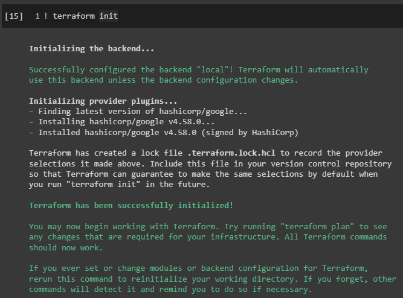
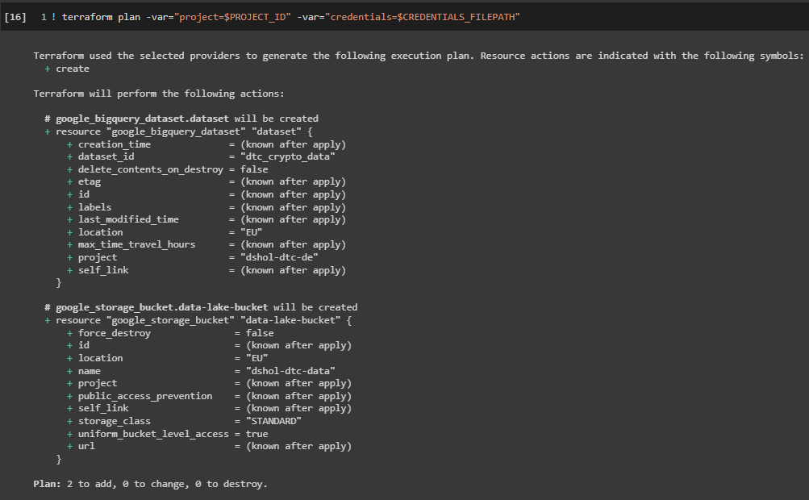
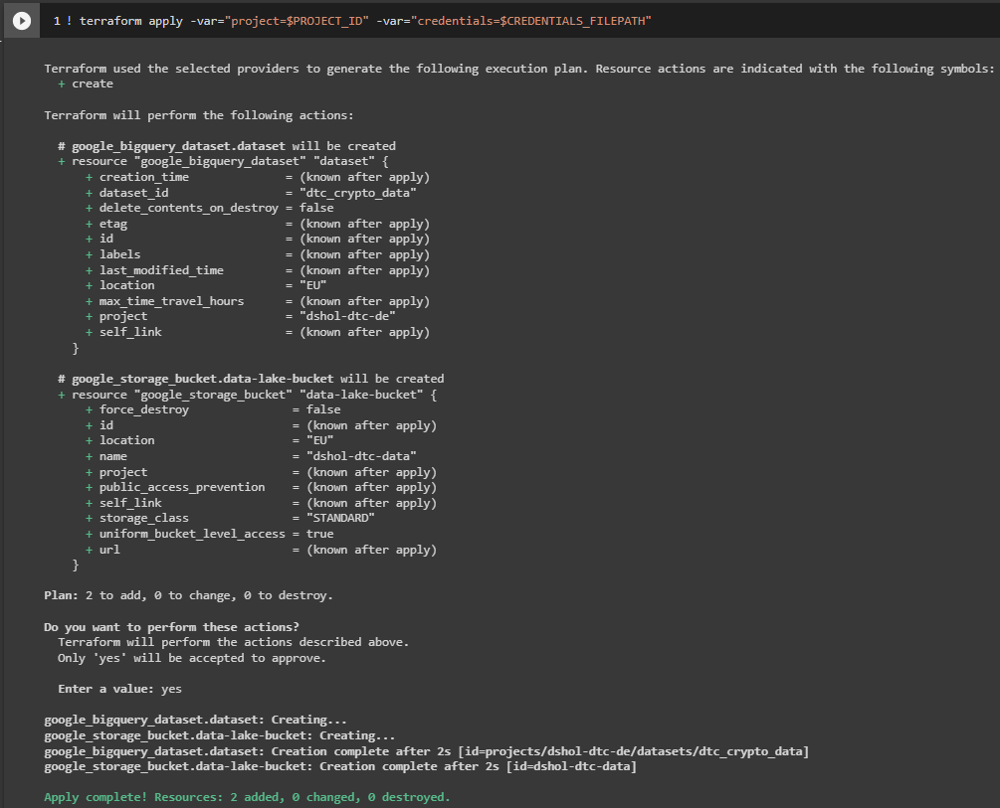

## Instructions to create GCP infrastructure with Terraform 
### (run on [Google Colab](https://colab.research.google.com/))

We will create two resources:
 - Cloud Storage bucket - to store files with raw data
 - BigQuery dataset - to create tables from files

##### 1. Install Terraform:
```
! wget -O- https://apt.releases.hashicorp.com/gpg | gpg --dearmor | sudo tee /usr/share/keyrings/hashicorp-archive-keyring.gpg
! echo "deb [signed-by=/usr/share/keyrings/hashicorp-archive-keyring.gpg] https://apt.releases.hashicorp.com $(lsb_release -cs) main" | sudo tee /etc/apt/sources.list.d/hashicorp.list
! sudo apt update && sudo apt install terraform
```

##### 2. Add JSON file with GCP credentials into start folder (`/content/`), then create variables:
```
%env PROJECT_ID=...
%env CREDENTIALS_FILEPATH=...
```

##### 3. Authorize with `gcloud`:
```
! gcloud auth application-default login
```

I also needed to run this command:
```
! gcloud auth application-default set-quota-project $PROJECT_ID
```

##### 5. Clone repo and navigate to `terraform` folder:
```
! git clone https://github.com/dmitry-rvn/DTC-DE-Project.git
%cd DTC-DE-Project/src/terraform
```

##### 6. Initialize terraform:
```
! terraform init
```



##### 7. Plan actions:
```
! terraform plan -var="project=$PROJECT_ID" -var="credentials=$CREDENTIALS_FILEPATH"
```



##### 8. Apply execution plan:
```
! terraform apply -var="project=$PROJECT_ID" -var="credentials=$CREDENTIALS_FILEPATH"
```



---

**After project being completed**, destroy infrastucture:
```
! terraform destroy -var="project=$PROJECT_ID" -var="credentials=$CREDENTIALS_FILEPATH"
```
